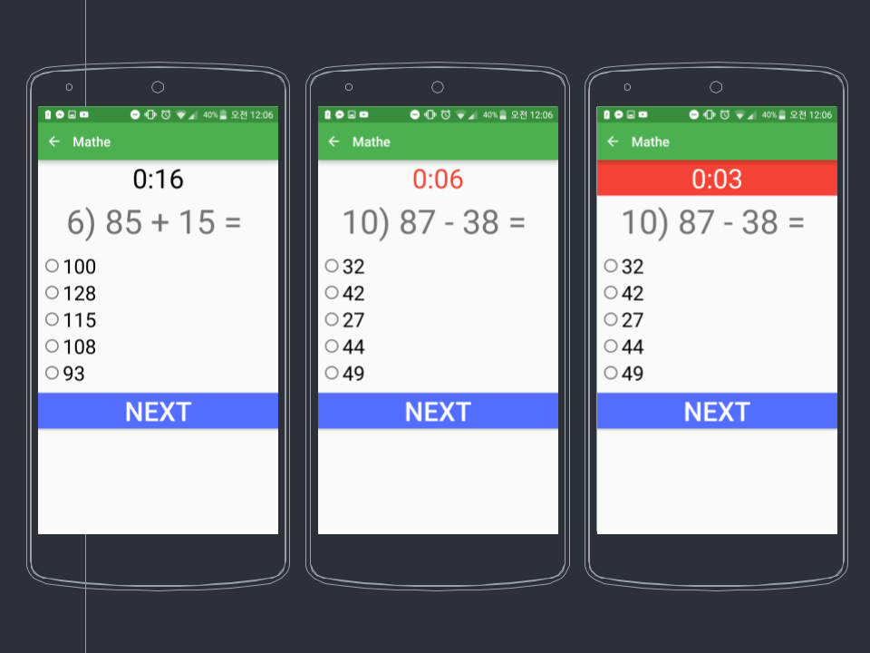

# Mathe

Mathe is an Android app aimed towards elementary school children to help them improve their mental math by having them quickly solve math problems against a timer.

## Technologies:
* Android Java

## Snapshot:
Click [here](https://docs.google.com/presentation/d/1-Z5J2_TpPXk5DyNAYfXssNg7d44YLvwHxwrqIiww24I/edit?usp=sharing) for a brief slide show presentation about the app.

## Authors:
* **Frederick Kim**
* **Charles Qi**